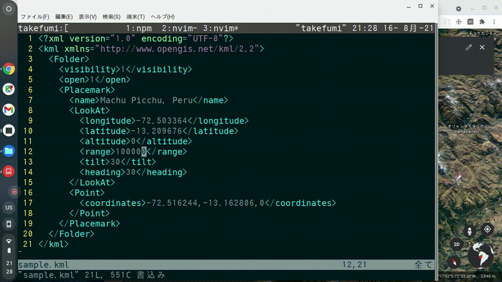

# dev-kml-server
Reload your developing kml-file automatically on Google Earth.

## DEMO



## Usage

1. `npm install fktk/dev-kml-server`
2. Edit href content in ./server-file/server.kml

```xml
<?xml version="1.0" encoding="UTF-8"?>
<kml xmlns="http://www.opengis.net/kml/2.2">
  <Document>
    <NetworkLink>
      <name>Serve kml</name>
      <visibility>1</visibility>
      <open>1</open>
      <refreshVisibility>0</refreshVisibility>
      <flyToView>0</flyToView>
      <Link>
HERE!   <href>https://YOUR_LOCAL_IP_ADDRESS:PORT/YOUR_KML_FILE.kml</href>
        <refreshMode>onInterval</refreshMode>
        <refreshInterval>2</refreshInterval>
      </Link>
    </NetworkLink>
  </Document>
</kml>
```

3. `npm run start -- --host=YOUR_LOCAL_IP_ADDRESS --port=PORT`
4. Open [Google Earth](https://earth.google.com/web/) and upload server.kml file from New Project.
5. Edit /kml-file/YOUR_KML_FILE.kml. Then feature's location will be updated.
6. Push the feature's name you edited on Google Earth. Then camera view will be updated.

That's enough for my use case😊

## Note about "Trustworthy Authority"

On first load, your browser will warn you that the certificate does not come from a trusted authority.
This is good, because live-server is not a trusted certification authority.
Depending on your browser, you will need to either 'unsafely proceed' or add an exception,
both of which are usually under an advanced options in the prompt.
